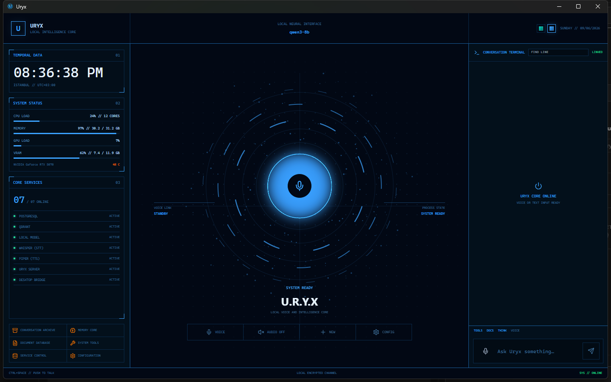
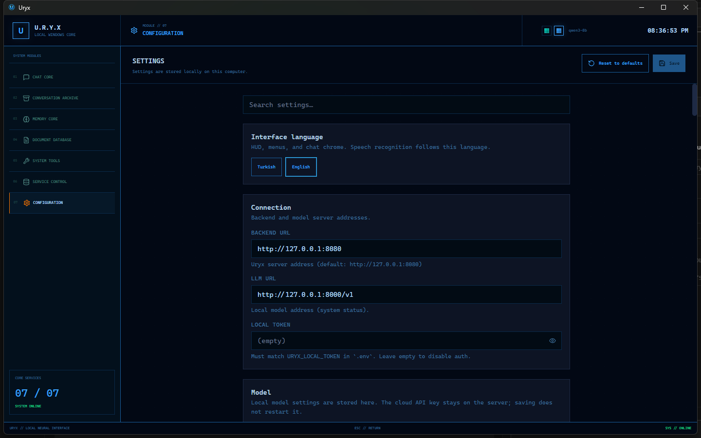
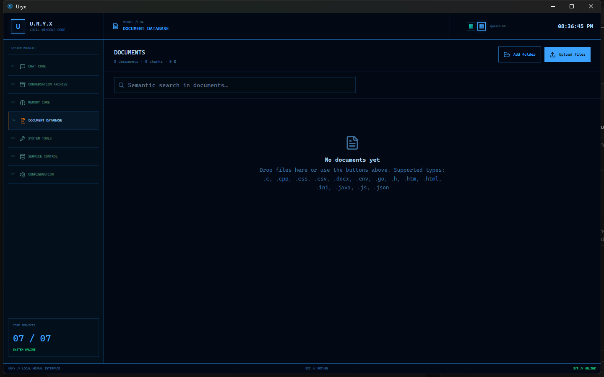
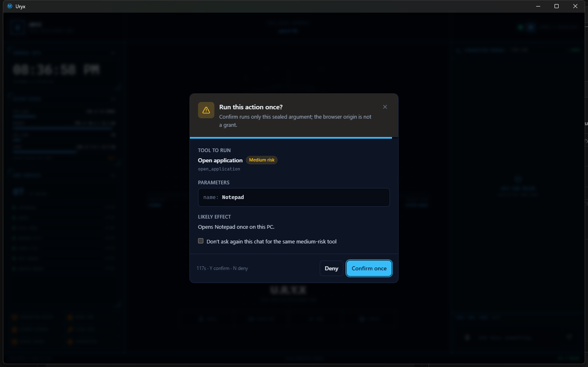

# Uryx

Local-first desktop AI for **Windows 11**. Chat, voice, memory, documents, and
allowlisted PC actions — running on this computer. No subscription. Your files
do not go to a Uryx cloud.

[Türkçe](README.tr.md)

The Windows installer is **unsigned** (SmartScreen may warn). Choose **More info →
Run anyway**. That is not a signed publisher.

## Screenshots

## Quick start

1. Download `Uryx-Setup.exe` from [GitHub Releases](https://github.com/uguredm/Uryx/releases).
2. Run the installer (administrator is not required).
3. Open **Uryx**.
4. If Docker Desktop is missing, Uryx downloads the **official** installer from
   docker.com. Windows will ask for administrator approval (**UAC**). Uryx does
   not install Docker silently and does not bundle Docker in Setup.
5. Wait until the local engine is green. Uryx starts its own services.
6. If a language model file is missing, pick a model card in Settings. You do
   not run PowerShell scripts.
7. Talk or type. Cloud API keys are optional and pasted in Settings.
8. When a new version is published, Uryx shows a dialog — you confirm, then it
   installs.

GPU is a **target** (for example an RTX 5070 12 GB), not a hard requirement.
Without a GPU the app still opens; chat may use a smaller local model or stay
limited.

The default interface language is **English**. Turkish is a Settings choice.
Turkish HUD labels use ALL-CAPS; ordinary sentences stay sentence case.

## What you get

- **Chat** — text and voice on a dark HUD, plus history, memory, documents,
  tools, system status, and settings.
- **Local model** — a GGUF LLM served by **llama.cpp** (OpenAI-compatible
  `/v1`) inside Docker, typically **Qwen3 8B** when the GPU can hold it.
- **Speech** — **Faster-Whisper** for speech-to-text (CPU by default) and
  **Piper** for speech. Wake-word is off unless you turn it on.
- **Documents (RAG)** — files are chunked, embedded, and searched in
  **Qdrant**. Optional CPU rerank; OCR for scans when enabled.
- **Memory** — durable facts extracted from conversation, stored in
  **PostgreSQL**.
- **Windows tools** — open apps, files, Outlook (read), browser snapshot,
  and similar **allowlisted** host actions. Medium and high risk tools ask
  before they run. The model never gets a free shell.
- **Optional cloud** — paste a provider key in Settings if you want a cloud
  fallback. Local tool and file results stay on the local path.

## How it is built

Uryx is a **Windows desktop app** plus a **local Docker stack**. The UI does
not run inside a container.

| Piece | Role |
|---|---|
| **Electron + React + TypeScript** | Window, tray, HUD, host tools |
| **FastAPI (Python)** | Chat orchestration, tools, RAG, memory APIs |
| **llama.cpp** | Local LLM (`/v1/chat/completions`) |
| **Qdrant** | Vector index for documents |
| **PostgreSQL** | Conversations and memory |
| **Faster-Whisper** | Speech to text |
| **Piper** | Speech synthesis |
| **Docker Desktop / WSL2** | Runs the engine services |

Host tools (Notepad, clipboard, GPU stats, …) run in the Electron main
process over a localhost bridge. Backend tools stay in Docker. Both go
through an allowlist, JSON schema, and a risk policy.

## Privacy

Chats, documents, and memory stay on this PC. Uryx does not require an
account. Optional cloud keys are stored for the local server; they are not
required to install.

## Updates

Packaged installs check **public** GitHub Releases first (`latest.yml`). You
confirm before a download. The installer name stays `Uryx-Setup.exe`.

## Developers

Product users do not clone this repository. If you are changing the code:
[CONTRIBUTING.md](CONTRIBUTING.md). Architecture notes:
[ARCHITECTURE.md](ARCHITECTURE.md).

`@uryx/shared-types` stays at **0.1.0** (**sözleşme paketi bağımsız** from the
app version).

## License

[MIT](LICENSE)
