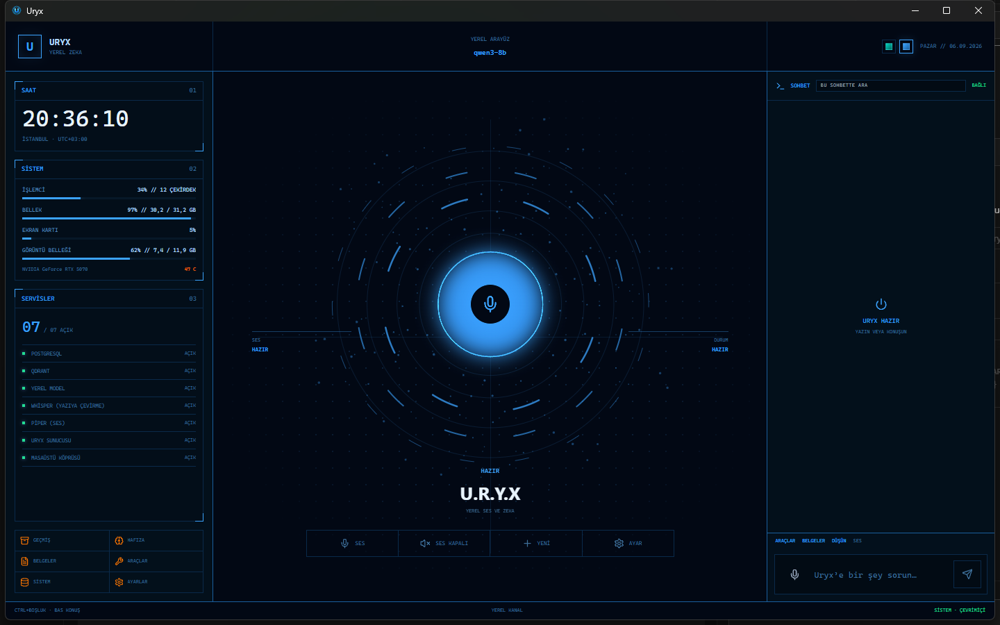
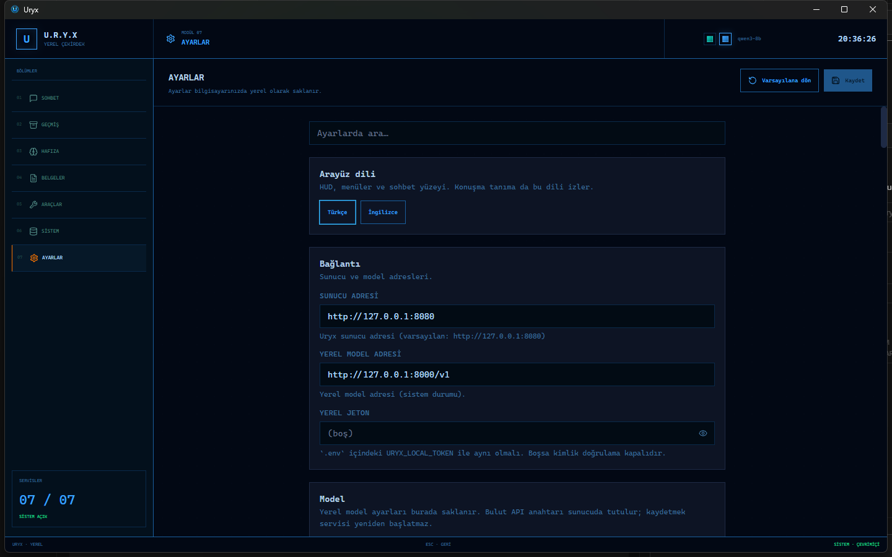
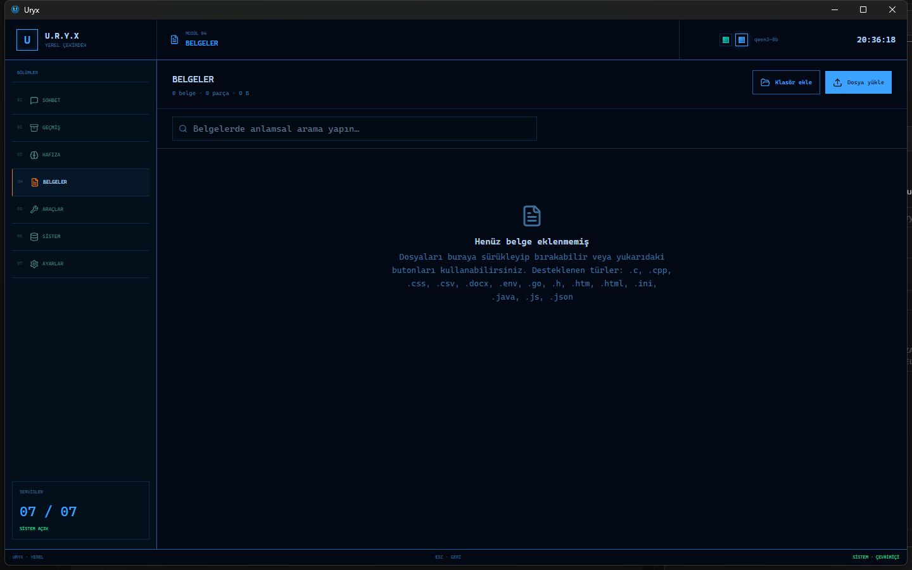
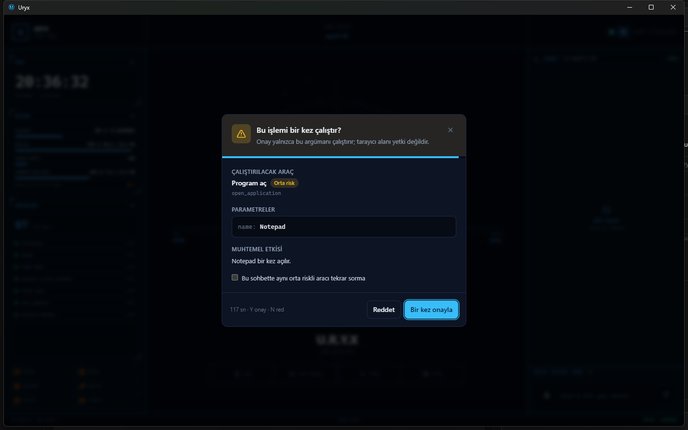

# Uryx

Windows 11 için **yerel** masaüstü yapay zekâ. Sohbet, ses, hafıza, belgeler ve
izin listeli bilgisayar işleri bu makinede çalışır. Abonelik yok. Dosyalarınız
bir Uryx bulutuna gitmez.

[English](README.md)

Kurucu **imzasızdır** (SmartScreen uyarı verebilir). **Ek bilgi → Yine de
çalıştır**. Bunu imzalı yayıncı sanmayın.

## Ekran görüntüleri

## Hızlı başlangıç

1. [GitHub Releases](https://github.com/uguredm/Uryx/releases) üzerinden `Uryx-Setup.exe` indirin.
2. Kurucuyu çalıştırın (yönetici gerekmez).
3. **Uryx**’i açın.
4. Docker Desktop yoksa Uryx docker.com’dan **resmi** kurucuyu indirir. Windows
   yönetici onayı (**UAC**) ister. Uryx Docker’ı sessiz kurmaz; Setup’a Docker
   gömülmez.
5. Yerel motor yeşil olana kadar bekleyin. Servisleri Uryx başlatır.
6. Dil modeli dosyası yoksa Ayarlar’dan kart seçin. PowerShell script çalıştırmazsınız.
7. Konuşun veya yazın. Bulut API anahtarı isteğe bağlıdır; Ayarlar’a yapıştırılır.
8. Yeni sürüm çıkınca Uryx pencere gösterir — onaylarsınız, sonra kurar.

GPU **hedeftir** (ör. RTX 5070 12 GB), şart değildir. GPU yoksa uygulama açılır;
sohbet daha küçük yerel modele düşebilir.

Varsayılan arayüz dili **İngilizce**. Türkçe Ayarlar’dan seçilir. Türkçe HUD
etiketleri ALL-CAPS; normal cümleler sentence case kalır.

## Neler var

- **Sohbet** — yazılı ve sesli koyu HUD; geçmiş, hafıza, belgeler, araçlar,
  sistem durumu, ayarlar.
- **Yerel model** — Docker içinde **llama.cpp** (OpenAI uyumlu `/v1`) ile GGUF
  LLM; GPU sığınca genelde **Qwen3 8B**.
- **Ses** — konuşmayı yazıya **Faster-Whisper** (varsayılan CPU), sese **Piper**.
  Uyanma kelimesi kapalıdır; siz açmadıkça çalışmaz.
- **Belgeler (RAG)** — dosyalar parçalanır, gömülür, **Qdrant**’ta aranır.
  İsteğe bağlı CPU rerank; taramalarda OCR.
- **Hafıza** — sohbetten çıkan kalıcı bilgiler **PostgreSQL**’de durur.
- **Windows araçları** — program açma, dosya, Outlook (okuma), tarayıcı
  anlığı ve benzeri **izin listeli** işler. Orta ve yüksek risk onay ister.
  Model serbest kabuk alamaz.
- **İsteğe bağlı bulut** — yedek için Ayarlar’a anahtar yapıştırılır. Araç ve
  dosya sonuçları yerel yolda kalır.

## Nasıl kuruluyor

Uryx bir **Windows masaüstü uygulaması** ve bir **yerel Docker yığınıdır**.
Arayüz konteyner içinde çalışmaz.

| Parça | Görev |
|---|---|
| **Electron + React + TypeScript** | Pencere, tepsi, HUD, host araçları |
| **FastAPI (Python)** | Sohbet orkestrasyonu, araçlar, RAG, hafıza API’si |
| **llama.cpp** | Yerel LLM (`/v1/chat/completions`) |
| **Qdrant** | Belge vektör indeksi |
| **PostgreSQL** | Sohbetler ve hafıza |
| **Faster-Whisper** | Konuşmayı yazıya çevirme |
| **Piper** | Konuşma sentezi |
| **Docker Desktop / WSL2** | Motor servisleri |

Host araçları (Notepad, pano, GPU… ) Electron ana süreçte, localhost köprüsü
üzerinden çalışır. Sunucu araçları Docker’da kalır. İkisi de izin listesi,
JSON şema ve risk politikasından geçer.

## Gizlilik

Sohbet, belge ve hafıza bu bilgisayarda kalır. Hesap gerekmez. Bulut anahtarı
zorunlu değildir.

## Güncellemeler

Kurulu kopya önce **public** GitHub Releases (`latest.yml`) bakar. İndirmeden
önce onay istenir. Kurucu adı `Uryx-Setup.exe` olarak kalır.

## Geliştiriciler

Ürün kullanıcısı bu depoyu klonlamaz. Kod değiştiriyorsanız:
[CONTRIBUTING.md](CONTRIBUTING.md). Mimari: [ARCHITECTURE.md](ARCHITECTURE.md).

`@uryx/shared-types` **0.1.0** kalır (sözleşme paketi, uygulama sürümünden bağımsız).

## Lisans

[MIT](LICENSE)
